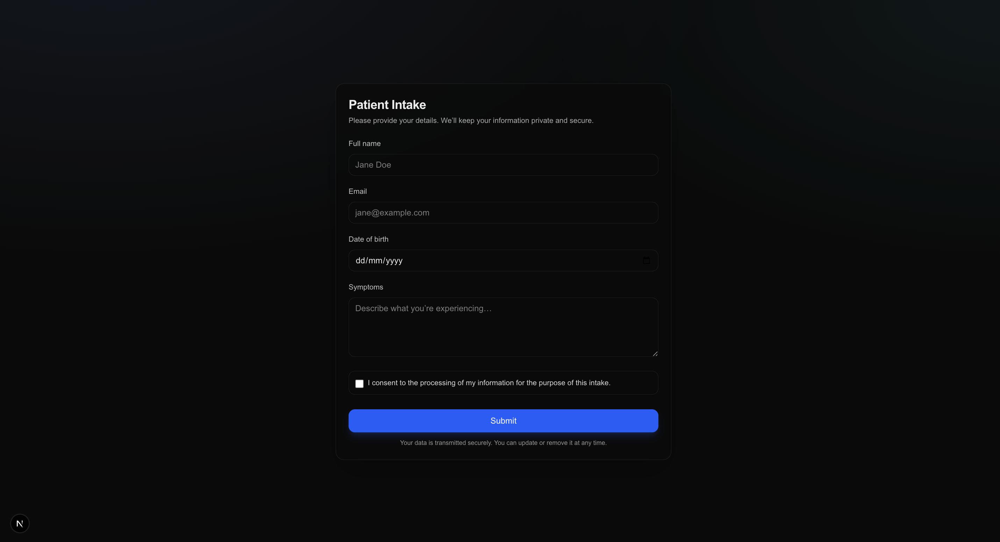
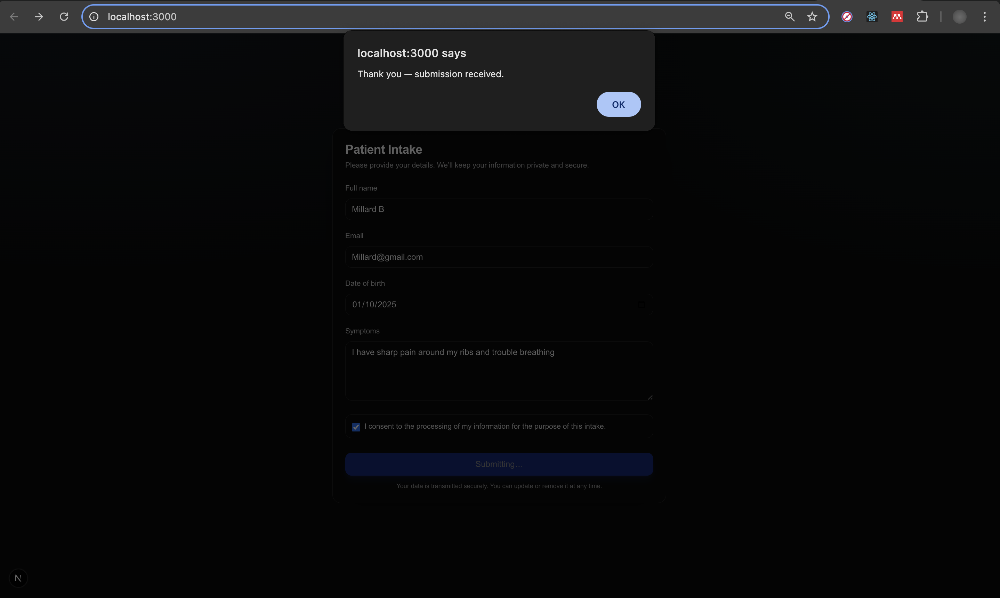

# Next.js + Node Intake Starter (TS, Tailwind, Zod, Yarn Workspaces)

A tiny full-stack starter you can clone to ship forms fast:
- **Web:** Next.js (App Router) + TypeScript + Tailwind
- **API:** Node/Express + TypeScript
- **Shared:** Zod schemas shared across web + api
- **Package Manager:** Yarn workspaces
- **Extras:** Accessible UI, client/server validation, simple error states

## Demo
- **Live Web:** <your Vercel URL>
- **API Health:** <your API URL>/health
- **Loom Walkthrough:** <your Loom link>

## Screens



## Tech
Next.js • React Hook Form • Zod • Tailwind • Express • TypeScript • Yarn Workspaces

## Run locally
```bash
yarn
# build shared types once (or use transpilePackages)
yarn workspace @starter/shared build
# dev both web+api
yarn dev
